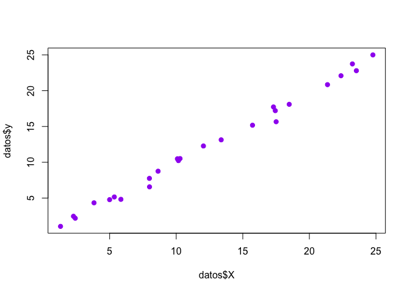
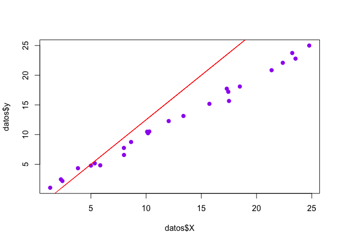
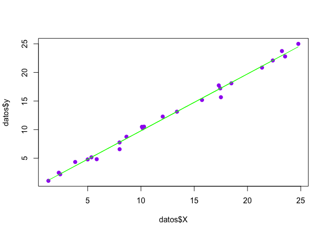
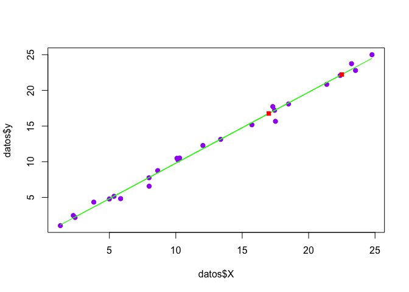

Regresion Lineal Simple
================

### Cuaderno 1

*Regresion Lineal Simple*.

Este cuaderno pertenece al libro de Fundamentos de Machine Learning.

### Licencia

Copyright 2018 Nerdyne A.I / Fundamentos de Machine Learning.

Se concede permiso por la presente, libre de cargos, a cualquier persona que obtenga una copia de este software y de los archivos de documentación asociados (el "Software"), a utilizar el Software sin restricción, incluyendo sin limitación los derechos a usar, copiar, modificar, fusionar, publicar, distribuir, sublicenciar, y/o vender copias del Software, y a permitir a las personas a las que se les proporcione el Software a hacer lo mismo, sujeto a las siguientes condiciones:

El aviso de copyright anterior y este aviso de permiso se incluirán en todas las copias o partes sustanciales del Software.

EL SOFTWARE SE PROPORCIONA "COMO ESTÁ", SIN GARANTÍA DE NINGÚN TIPO, EXPRESA O IMPLÍCITA, INCLUYENDO PERO NO LIMITADO A GARANTÍAS DE COMERCIALIZACIÓN, IDONEIDAD PARA UN PROPÓSITO PARTICULAR E INCUMPLIMIENTO. EN NINGÚN CASO LOS AUTORES O PROPIETARIOS DE LOS DERECHOS DE AUTOR SERÁN RESPONSABLES DE NINGUNA RECLAMACIÓN, DAÑOS U OTRAS RESPONSABILIDADES, YA SEA EN UNA ACCIÓN DE CONTRATO, AGRAVIO O CUALQUIER OTRO MOTIVO, DERIVADAS DE, FUERA DE O EN CONEXIÓN CON EL SOFTWARE O SU USO U OTRO TIPO DE ACCIONES EN EL SOFTWARE.

### Cargar Datos del Set de Entrenamiento

``` r
# setwd("~/Dropbox/ML Courses/Fundamentos ML/Cuadernos")

datos <- read.csv('datasets/LR_1.csv')
datos$X
```

    ##  [1] 23.231539 17.441021  4.997889  5.844811 13.377248 10.168829 18.486540
    ##  [8]  5.351090  1.311522  7.995113  2.284214 17.504608 10.287065  8.637073
    ## [15]  3.826347 23.530349  7.987137 17.305979  2.417957 21.360833 15.729758
    ## [22] 24.771599 10.087741 22.375761 12.044081

### Desplegar la Relacion de Variables XY

``` r
plot(datos$X, datos$y, pch = 19, col = "purple")
```



### Desarrollo del modelo con hipotesis b0 = -2.5 y b1 = 1.5

``` r
modeloLineal <- function(x, b_0, b_1){
  return (b_0 + (b_1 * x))
}

plot(datos$X, datos$y, pch = 19, col = "purple")
lines(datos$X, modeloLineal(datos$X, -2.5, 1.5), type="l", lty=1, col = "red")
```



### Obtencion de la Media de las Variables

``` r
promedioX <- mean(datos$X)
promedioy <- mean(datos$y)
```

### Calculo de b1

``` r
numerador <- sum((datos$X - promedioX) * (datos$y - promedioy))
denominador  <- sum((datos$X - promedioX)^2)
b1 <- numerador / denominador
```

### Calculo de b0

``` r
b0 <- promedioy - (b1 * promedioX)
```

### Despliegue de Modelo "Debidamente" Ajustado

``` r
plot(datos$X, datos$y, pch = 19, col = "purple")
lines(datos$X, modeloLineal(datos$X, b0, b1), type="l", lty=1, col = "green")
```

 \#\#\# Funcion de Prediccion

``` r
predecir <- function(x){
  return (modeloLineal(x, b0, b1))
}
```

### Prediccion con x = 17 & x = 22.5

``` r
# volvemos a desplegar los datos y la linea verde
plot(datos$X, datos$y, pch = 19, col = "purple")
lines(datos$X, modeloLineal(datos$X, b0, b1), type="l", lty=1, col = "green")

#predicciones!
points(17, predecir(17), pch = 15, col = "red")
points(22.5, predecir(22.5), pch = 15, col = "red")
```



### Estimacion del Error Residual

``` r
yp <- modeloLineal(datos$X, b0, b1)
yi <- datos$y

error <- sqrt( sum((yi-yp)^2) / length(yi))

print(error)
```

    ## [1] 0.5660185
